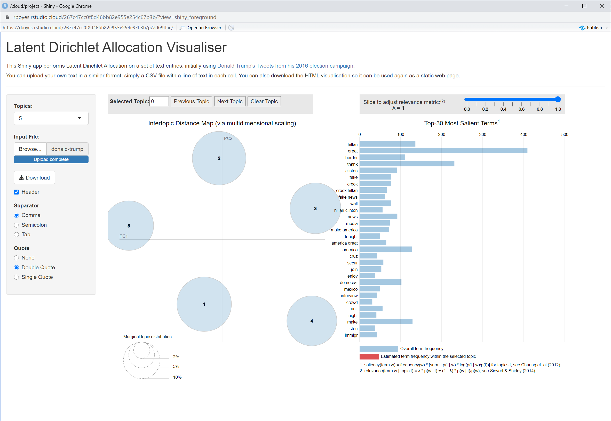

# Shiny LDA
An interactive shiny application demonstrating Latent Dirichlet Allocation: https://en.wikipedia.org/wiki/Latent_Dirichlet_allocation

Currently deployed at: https://rboyes.shinyapps.io/shinylda

This shiny app works by simply uploading a csv file with a single entry of text per row, all in a single column. An example csv file of Donald Trump's tweets is included in the repo.

Also included is the functionality to download the LDA visualisation as an HTML page after rendering.

